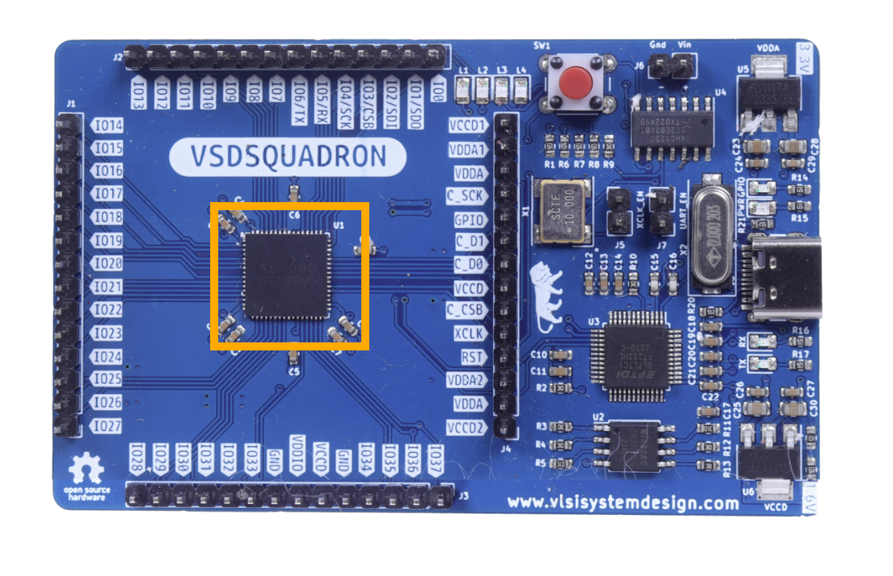
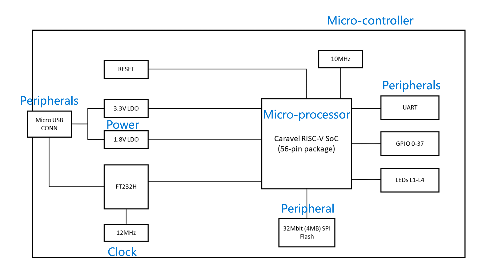
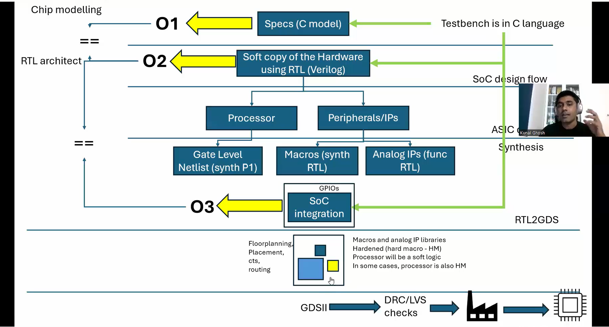
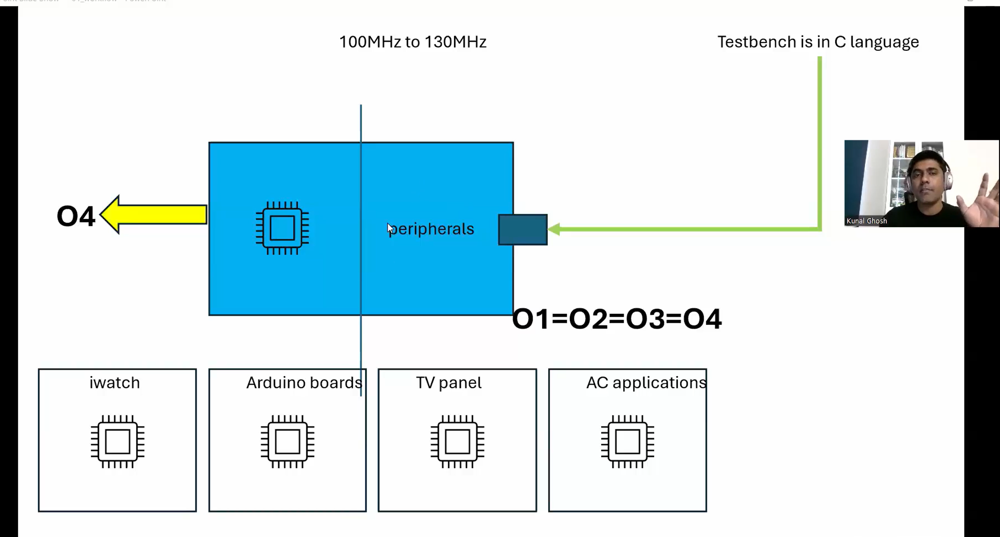

# Summary of "Getting started with Digital VLSI SOC Design and Planning"

Note: Everything in given below is silicon proven with reference to VSDSquadron board. 
(Silicon proven means all the theory here is practiced and successfully taped out as the Caravel RISC-V SoC used on the board)

(Source: [VSDSquadron datasheet](https://www.vlsisystemdesign.com/wp-content/uploads/2022/09/vsdsquadron_specs_v1.pdf))

**Goal** : Given an application (like MS Word, Chrome, etc), make sure it runs on a chip (our design is a processor).
**Task** : Design the chip that runs the application.

The SoC design flow, which is typically followed in the industry when designing a chip for any application, normally takes 14-16 months, with 4 months for fabrication. This flow pertains to designing the SoC and not the whole board.

# SoC DESIGN AND PLANNING FLOW

## Deciding the specifications (CHIP MODELLING)
- Given an application (which also acts as a testbench) in the C language, it's first run on the GCC compiler. This serves as a reference output for all the subsequent verifications.
- The application is then run on a cross compiler (decided based on the architecture to use, RISC-V, ARM, or x86). This gives a lot of low-level details about the application to decide on the specification of the processor.
  (A compiler generates an executable for the system’s native architecture, while a cross-compiler generates an executable for a target architecture, such as RISC-V, ARM, or x86.)
  (A cross-compiler is required because the SoC architecture may differ from the host system used for development.)
- When reference == cross_compiler_output, the specs are frozen (or finalized).

## Hardware representation of Spec using RTL (RTL ARCHITECT)
- Once the specifications of the SoC are decided, it's coded/represented using HDL (Hardware Description Languages) like Verilog, VHDL, etc.
- This step uses software to implement the specs in hardware (or logic gates for digital designs).
- The application (testbench) is run on this model, and if its output == reference, then the hardware representation is fixed.
(The application is run every time the model changes to ensure functional correctness during each stage of hardware representation.)

## SoC design flow begins
- The hardware representation is divided into **Processor** and **Peripherals/IPs**.
- The processor (or microprocessor) is responsible for the calculations/processing of the given data.
- Peripherals provide input to and output from the processor. Processors rely on peripherals to interact with the environment. 
- A microcontroller = microprocessor + peripherals; it is a processor capable of interacting with the environment.

(Source: [VSDSquadron datasheet](https://www.vlsisystemdesign.com/wp-content/uploads/2022/09/vsdsquadron_specs_v1.pdf))

## Synthesis
- A synthesizable code can be successfully converted to circuit/gates/hardware using appropriate tools. (eg. and, or - logic gate instances in Verilog)
- A non-synthesizable code can't be converted to hardware/gates. (e.g. mos construct in Verilog)
- Processor-related RTL must be strictly synthesizable to generate a gate-level netlist.
- Peripherals can be macros or analog IPs.
- Macros are pre-designed, pre-verified hardware blocks implementing a specific function at the transistor or gate level. The code must be strictly synthesizable.
- Analog IPs are functional models of analog designs. Since they model the behaviour, they do not need to be synthesizable.

## SoC integration
- All the blocks from previous stages are appropriately integrated to create a System on Chip (SoC) using communication protocols (eg. GPIO).
- The application (testbench) is run on the SoC.
- If SoC_output == reference, then proceed to next stage.

## RTL2GDS
- Previous stages handled gate-level behaviour, while this level handles physical or device-level behaviour.
- Physical design - floorplanning, PnR, STA, etc are done here to prepare the design for fabrication in the foundry. (Foundry is where the chips are manufactured)
- Finally, a GDSII (Graphical Data Stream Information Interchange) file is created, which contains all the information required for fabrication.
- The GDSII file is typically large, hence running the application (testbench) on it is computationally intensive and inefficient. Thus, it undergoes DRC and LVS checks before sending to the foundry.

## Post fabrication
- The process of sending a GDSII file to the foundry is called **tape-out**.
- After fabrication, the chips are delivered, often referred to as **tape-in**.
- A chip(SoC in our case) by itself cannot be used to run any applications, thus it's put on a board that contains the necessary peripherals using a PCB (Printed Circuit Board).
- Firmware is then written to manage communication between peripherals and the processor, enabling the application to run.
- The application (testbench) is run on this SoC board, and if its output == reference, then we have a working chip that supports the given application.
- The SoC board can be reused in different systems, provided the operating frequency and required specifications are compatible.

