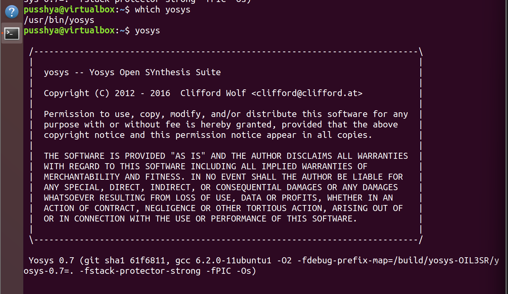
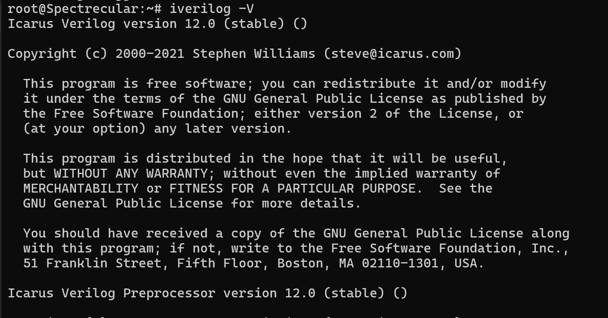
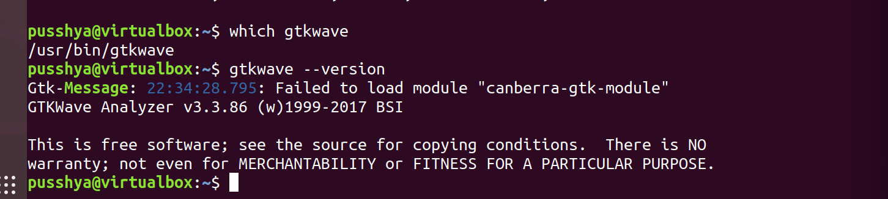

# Tool Setup Guide

This repository contains instructions to set up a Digital VLSI development environment using **Ubuntu** and essential EDA tools like **Yosys**, **Icarus Verilog (iverilog)**, and **GTKWave**.

---

## System Requirements

Before starting, make sure your system meets the following requirements:

- **RAM:** 6 GB minimum  
- **Storage:** 50 GB HDD minimum  
- **CPU:** 4 vCPUs  
- **OS:** Ubuntu 20.04 or higher  

For virtual machines, it is recommended to use [Oracle VirtualBox](https://www.virtualbox.org/wiki/Downloads).

---

## Tools Installation

### 1. Yosys

**Yosys** is an open-source synthesis tool for Verilog designs.  

**Installation Steps:**

```bash
# Update package list
sudo apt-get update

# Clone the Yosys repository
git clone https://github.com/YosysHQ/yosys.git
cd yosys

# Install prerequisites
sudo apt install make        # If 'make' is not installed
sudo apt-get install build-essential clang bison flex \
 libreadline-dev gawk tcl-dev libffi-dev git \
 graphviz xdot pkg-config python3 libboost-system-dev \
 libboost-python-dev libboost-filesystem-dev zlib1g-dev

# Configure, compile, and install Yosys
make config-gcc
make
sudo make install
```
**OR**

```bash
sudo apt install yosys
```
For tool check: 

```bash
yosys -V #checks the version
yosys #launches the software
```


## 2. Icarus Verilog (iverilog)

**Icarus Verilog** is an open-source Verilog simulation and synthesis tool.  

### Installation Steps:

```bash
sudo apt-get update
sudo apt-get install iverilog
```
For tool check: 

```bash
iverilog -V #checks the version
```


## 3. GTKWave

**GTKWave** is a waveform viewer used to visualize simulation results in digital design.

---

## Installation Steps

Open a terminal and run the following commands:

```bash
sudo apt-get update
sudo apt install gtkwave
```
For tool check: 

```bash
gtkwave --version #checks the version
```

