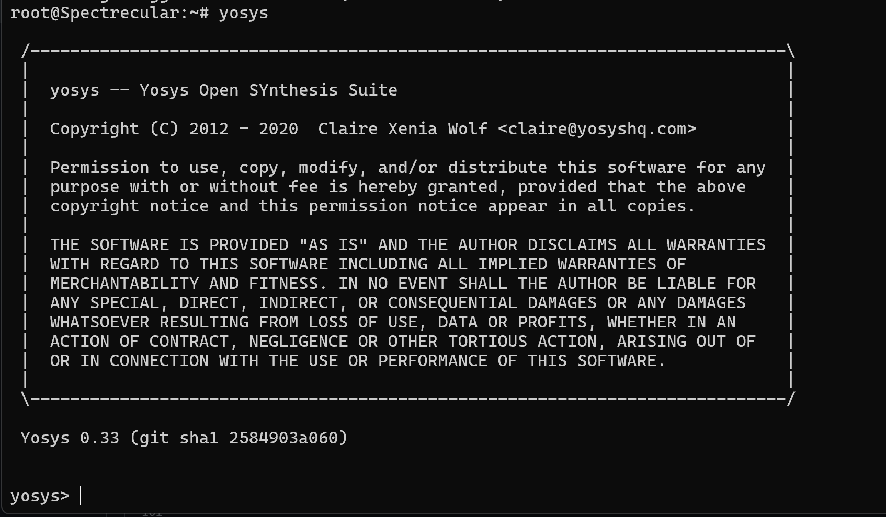
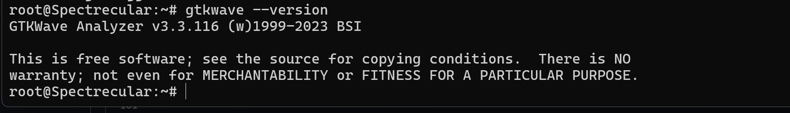

# Tool Setup Guide

This repository contains instructions to set up a Digital VLSI development environment using **Ubuntu** and essential EDA tools like **Yosys**, **Icarus Verilog (iverilog)**, and **GTKWave**.

---

## System Requirements

Before starting, make sure your system meets the following requirements:

- **RAM:** 6 GB minimum  
- **Storage:** 50 GB HDD minimum  
- **CPU:** 4 vCPUs  
- **OS:** Ubuntu 20.04 or higher  

For virtual machines, it is recommended to use [Oracle VirtualBox](https://www.virtualbox.org/wiki/Downloads).
**Important note** : Ubuntu under WSL has been used here, virtual machine may be used.

---

# Tools Installation

## 1. Yosys

**Yosys** is an open-source synthesis tool for Verilog designs.  

**Installation Steps:**

```bash
# Update package list
sudo apt-get update

# Clone the Yosys repository
git clone https://github.com/YosysHQ/yosys.git
cd yosys

# Install prerequisites
sudo apt install make        # If 'make' is not installed
sudo apt-get install build-essential clang bison flex \
 libreadline-dev gawk tcl-dev libffi-dev git \
 graphviz xdot pkg-config python3 libboost-system-dev \
 libboost-python-dev libboost-filesystem-dev zlib1g-dev

# Configure, compile, and install Yosys
make config-gcc
make
sudo make install
```
**OR**

```bash
sudo apt install yosys
```
For tool check: 

```bash
yosys -V #checks the version
yosys #launches the software
```


---

## 2. Icarus Verilog (iverilog)

**Icarus Verilog** is an open-source Verilog simulation and synthesis tool.  

### Installation Steps:

```bash
sudo apt-get update
sudo apt-get install iverilog
```
For tool check: 

```bash
iverilog -V #checks the version
```


---

## 3. GTKWave

**GTKWave** is a waveform viewer used to visualize simulation results in digital design.

## Installation Steps

Open a terminal and run the following commands:

```bash
sudo apt-get update
sudo apt install gtkwave
```
For tool check: 

```bash
gtkwave --version #checks the version
```


---

## 4. OpenSTA

An open-source Static Timing Analysis tool used to evaluate setup, hold, and timing paths in digital circuits after synthesis.

## Installation steps

Open the terminal and execute the following commands:

```bash
sudo apt install -y     git build-essential cmake g++ gcc clang     tcl tcl-dev swig bison flex     libeigen3-dev zlib1g-dev     libreadline-dev
cd ~
mkdir -p software && cd software
git clone https://github.com/davidkebo/cudd
cd cudd/cudd_versions
tar xvfz cudd-3.0.0.tar.gz
cd cudd-3.0.0
./configure --prefix=$HOME/software/cudd
make -j$(nproc)
make install
cd ~
cd software
git clone https://github.com/The-OpenROAD-Project/OpenSTA
cd OpenSTA
mkdir build && cd build
cmake -DCUDD_DIR=$HOME/software/cudd ..
make -j$(nproc)
sudo make install
```
<details>
 <summary> Detailed explanation </summary>

1. Installing Dependencies
```bash
sudo apt install -y git build-essential cmake g++ gcc clang tcl tcl-dev swig bison flex libeigen3-dev zlib1g-dev libreadline-dev
```
- `git` — CUDD and OpenSTA source code is hosted online. Git is required to download the source code repositories. Without it, you cannot get the latest source or manage versions.
- `build-essential` — Includes the GCC compiler, make, and basic build tools. Both CUDD and OpenSTA are written in C/C++, so these tools are essential to compile the source code into executables and libraries.
- `cmake` — OpenSTA uses CMake as its build system generator. CMake reads the project configuration and generates Makefiles tailored to your system. Without CMake, OpenSTA cannot be compiled easily.
- `g++`, `gcc`, `clang` — These are C and C++ compilers. CUDD and OpenSTA contain both C and C++ code. Different parts may require different compilers, so having all ensures successful compilation.
- `tcl`, `tcl-dev` — Tcl is used for scripting interfaces in OpenSTA. Some parts of OpenSTA may use Tcl scripts to control simulation or automation tasks. The development headers (tcl-dev) are needed to compile OpenSTA with Tcl support.
- `swig` — Some projects, including OpenSTA, may provide interfaces to other scripting languages (like Python or Tcl). SWIG generates the necessary wrapper code to expose C/C++ libraries to these languages.
- `bison`, `flex` — These are required by CUDD and OpenSTA for parsing custom input formats. Bison generates a parser from a grammar. Flex generates a lexical analyzer to break input text into tokens. Together, they allow the software to read circuit netlists or other domain-specific languages.
- `libeigen3-dev` — Provides headers for Eigen, a library for linear algebra. OpenSTA uses Eigen for matrix computations needed in timing analysis or other internal calculations.
- `zlib1g-dev` — Provides headers for zlib compression. Some input/output operations or data structures in CUDD/OpenSTA may optionally compress data to save memory or disk space.
- `libreadline-dev` — Adds interactive command-line editing and history. Useful when using OpenSTA or CUDD in a terminal, so you can edit commands, use history, and navigate easily in the CLI interface.

Purpose: This installs all the tools needed to compile CUDD and OpenSTA from source.

2. Creating a Software Directory
```bash
cd ~
mkdir -p software && cd software
```

- `cd ~` — Moves to the user’s home directory.
- `mkdir -p software` — Creates a folder named software. The -p ensures it is created if it doesn’t exist already.
- `&&` - command1 && command2 tells the terminal to execute command1 and then command2. 
- `cd software` — Moves into the newly created software folder.

Purpose: Keeps all downloaded and compiled software organized in one place.

3. Cloning the CUDD Repository
```bash
git clone https://github.com/davidkebo/cudd
cd cudd/cudd_versions
```
- `git clone` — Downloads the full CUDD repository.
- `cd cudd/cudd_versions` — Moves into the folder where versioned tarballs like cudd-3.0.0.tar.gz are stored.

Purpose: Provides access to multiple versions of CUDD if needed.

 <details>
  <summary> Why is `wget` not used? </summary>
 
 ```bash
 wget https://davidkebo.com/cudd-3.0.0.tar.gz
 wget https://github.com/davidkebo/cudd/blob/main/cudd_versions/cudd-3.0.0.tar.gz
 wget https://github.com/davidkebo/cudd/raw/main/cudd_versions/cudd-3.0.0.tar.gz
 file cudd-3.0.0.tar.gz  #checks the file type
 ```
 When `wget` or web-get is used, it downloads the HTML file (checked using the `file` command), which is not what we need. Hence, `git clone` command is used instead. 
 </details>

 <details>
  <summary> Why is CUDD necessary to run OpenSTA? </summary>
 
 **What CUDD is**
- CUDD stands for Colorado University Decision Diagram package.

- It is a library that implements Binary Decision Diagrams (BDDs) and related data structures like Zero-suppressed Decision Diagrams (ZDDs).

- BDDs are highly efficient data structures for representing and manipulating Boolean functions. It helps in the simplification of Boolean functions and to fine critical or other paths. 

**Why OpenSTA needs CUDD**

OpenSTA (Open-source Static Timing Analyzer) performs timing analysis of digital circuits, which involves:
- Modeling complex logic networks
 - Digital circuits can have millions of logic gates.
 - OpenSTA uses decision diagrams (BDDs) to efficiently represent logic functions in memory without enumerating every input combination.
- Propagating timing constraints through the circuit
 - Timing relationships and path delays often depend on the logic structure of the circuit.
 - BDDs allow OpenSTA to compute arrival times and slack values efficiently for all possible signal paths.
- Optimizations and equivalence checking
 - OpenSTA may need to check if two logic sub-networks are equivalent or simplify logic during analysis.
 - CUDD provides fast, memory-efficient operations on Boolean functions for these tasks.
 </details>

In short:
- OpenSTA does timing analysis, but to analyze combinational logic efficiently, it needs Boolean function manipulation.
- CUDD provides decision diagram algorithms that are fast and memory-efficient.
- Without CUDD, OpenSTA cannot handle large digital circuits effectively — some features like logic representation, optimization, and path analysis would fail or be extremely slow.

4. Extracting the Source Code
```bash
tar xvfz cudd-3.0.0.tar.gz
cd cudd-3.0.0
```
- `tar xvfz` — Extracts a .tar.gz archive.
- `x` = extract
- `v` = verbose (shows files being extracted)
- `f` = specifies filename
- `z` = decompress using gzip
- `cd cudd-3.0.0` — Moves into the extracted CUDD source folder.

5. Configuring CUDD for Installation
   
```bash
./configure --prefix=$HOME/software/cudd
```
- `./configure` — Prepares the build system for your machine. Checks compilers, libraries, and options.
- `--prefix=$HOME/software/cudd` — Tells the build system to install CUDD under your home folder, not system-wide.

Purpose: Makes it easier to use CUDD later without requiring root permissions.

6. Compiling CUDD
   
```bash
make -j$(nproc)
```
- `make` — Builds the software according to the generated Makefile.
- `-j$(nproc)` — Uses all available CPU cores to speed up compilation. $(nproc) returns the number of CPU cores.

7. Installing CUDD
    
`make install` - Installs the compiled library and headers to the directory specified in `--prefix`.

8. Cloning OpenSTA Repository
```bash
cd ~
cd software
git clone https://github.com/The-OpenROAD-Project/OpenSTA
cd OpenSTA
```
- Returns to the software directory.
- Clones the OpenSTA repository from GitHub.
- Moves into the OpenSTA folder to prepare for compilation.

9. Preparing OpenSTA Build Directory
    
`mkdir build && cd build` - Creates a separate folder called build inside OpenSTA.

Purpose: Keeps the build files separate from the source code (common CMake practice).

10. Configuring OpenSTA with CMake
```
cmake -DCUDD_DIR=$HOME/software/cudd ..
```
- `cmake ..` — Configures the project using CMake, pointing to the parent source folder.
- `-DCUDD_DIR=$HOME/software/cudd` — Tells OpenSTA where CUDD is installed so it can link against the CUDD library.
- `-D` is generally used to define a variable or macro that will be visible to the program being built or executed.

11. Compiling OpenSTA

`make-j$(nproc)` - Builds OpenSTA using all CPU cores and generates the OpenSTA executable that can perform timing analysis.

12. Installing OpenSTA

`sudo make install` - Installs OpenSTA system-wide (requires sudo). Executables and libraries are placed in standard directories so you can run opensta from anywhere.

</details>
//opensta_install

For tool check:
```bash
sta  #opens the OpenSTA console/terminal
```
---

## 5. Ngspice

An open-source circuit simulator used for analog, digital, and mixed-signal simulations based on SPICE models.

## Installation steps

Open a terminal to run the following commands:

```bash
sudo apt update
sudo apt install -y     git build-essential autoconf automake libtool     bison flex     libx11-dev libxaw7-dev libxmu-dev libxext-dev libxft-dev     libfontconfig1-dev libxrender-dev libfreetype6-dev     libreadline-dev libfftw3-dev
git clone https://git.code.sf.net/p/ngspice/ngspice
cd ngspice
./compile_linux.sh
```
<details>
 <summary> Detailed explanation of the commands </summary>
 
 ```sudo apt update```

What it does:

- This command tells Ubuntu to update its package index, which is basically a local list of all available software and their versions.

- It fetches the latest package information from online repositories (software sources) configured on your system.

- It does not upgrade or install anything yet — it just refreshes the list so that your system knows what the latest versions are.

Why it’s needed:
Without running this, your system might try to install old versions or fail to find new packages.

```sudo apt install -y git build-essential autoconf automake libtool bison flex libx11-dev libxaw7-dev libxmu-dev libxext-dev libxft-dev libfontconfig1-dev libxrender-dev libfreetype6-dev libreadline-dev libfftw3-dev```

What it does:

- This command installs all the software and libraries needed to compile and build ngspice from source.

Let’s break down the key parts:

- ```sudo apt install``` — installs software packages using Ubuntu’s package manager.

- ```-y ``` — automatically answers “yes” to any confirmation prompts during installation.

Now, package by package:

- `git` – ngspice’s source code is hosted online. Git is needed to download and keep track of the source code. Without it, you cannot get the project from the repository.
- `build-essential` – This includes the GCC compiler, make, and other essential tools. ngspice is written in C, so you need a compiler and build tools to turn the source code into an executable program.
- `autoconf` – ngspice uses scripts to configure the build for your system. Autoconf automatically generates these scripts, checking system settings and available libraries.
- `automake` – Works with autoconf to generate portable Makefiles, which are instructions that tell make how to compile and link the program. This ensures ngspice can be built on many Linux systems without manual tweaks.
- `libtool` – Manages shared libraries during compilation, ensuring ngspice links properly to external libraries like X11, FFTW, or readline.
- `bison` – ngspice includes a command interpreter and parser for circuit netlists. Bison generates the parser code from a grammar file, allowing ngspice to understand input circuits.
- `flex` – Works with bison as a lexical analyzer, breaking input text into tokens for parsing. Together with bison, it allows ngspice to read and process netlist commands.
- `libx11-dev` – Provides development files for the X11 window system, which is the standard Linux graphical interface. Needed if you want to use ngspice’s GUI (graphical plots and windows).
- `libxaw7-dev`, `libxmu-dev`, `libxext-dev`, `libxft-dev` – These are additional X Window libraries required for GUI features like widgets, fonts, window extensions, and drawing graphics. Without them, ngspice’s GUI cannot display correctly.
- `libfontconfig1-dev`, `libxrender-dev`, `libfreetype6-dev` – Handle fonts and text rendering inside ngspice’s graphical plots. They allow proper display of text labels, numbers, and units in the GUI.
- `libreadline-dev` – Provides command-line editing, history, and auto-completion for the ngspice console interface. Makes the interactive CLI (command line interface) much more user-friendly.
- `libfftw3-dev` – Provides Fast Fourier Transform (FFT) functions, used by ngspice for signal processing, spectral analysis, and simulations that involve frequency-domain calculations.

Why it’s needed:
All these are dependencies — without them, ngspice cannot be compiled or may miss important features.

`git clone https://git.code.sf.net/p/ngspice/ngspice`

What it does:

- Downloads the source code of ngspice from its official repository on SourceForge into a new folder named `ngspice`.

- `git clone` basically creates a local copy of an online project.

Why it's needed:
You can’t build ngspice without having its source code first.

4. `cd ngspice`

What it does:

- Changes your current working directory to the newly created ngspice folder that was downloaded in the previous step.

- This folder contains all the files and scripts needed to compile ngspice.

Why it’s needed:
All the build commands (like compile scripts) must be run from inside this folder.

5. `./compile_linux.sh`

What it does:

- Runs the script named compile_linux.sh that comes with ngspice.

- The ./ means “run this script from the current directory.”

- The script automatically performs several steps:

 - Runs configuration checks for your system.
 
 - Generates the Makefile (the file that tells how to build the program).
 
 - Compiles the ngspice source code using the tools installed.
 
 - Optionally installs the compiled ngspice binary.

Why it’s needed:
Instead of manually running multiple commands to build ngspice, this script does it all automatically for Linux users.

</details>

//ngspice_install

For tool check:

```bash
ngspice -v #checks the version
```
